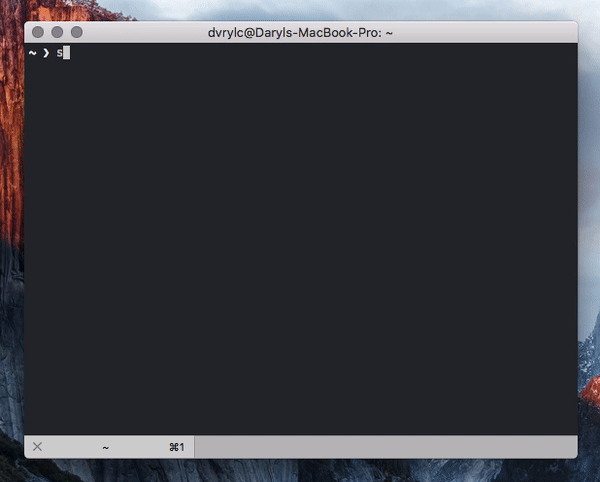

# Sentinel

> A command-line site monitor


## Installation

Sentinel requires Node.js v8.5 and above. To check your Node.js version, run `node -v`.

```console
$ npm install -g @dvrylc/sentinel
```

## Usage

```
$ sentinel [options]

A command-line site monitor
Config file: path/to/your/config/file

Options:

  -V, --version  output the version number
  -s, --setup    setup config file in the home directory
  -h, --help     output usage information
```

## Configuration

Sentinel relies on a config file for the list of sites to monitor, as well as some user-configurable settings.

When you first run Sentinel, it will prompt you to setup a config file in your home directory.

Subsequently, to locate the config file, run `sentinel -h`. 

To start afresh, run `sentinel -s`. Sentinel will prompt you to replace your existing config file with a fresh one.

### Configuration fields

`config.json` should always be a valid JSON object.

- `sites (array)`: Array of absolute (`http` or `https`) URLs to monitor

## License

MIT
